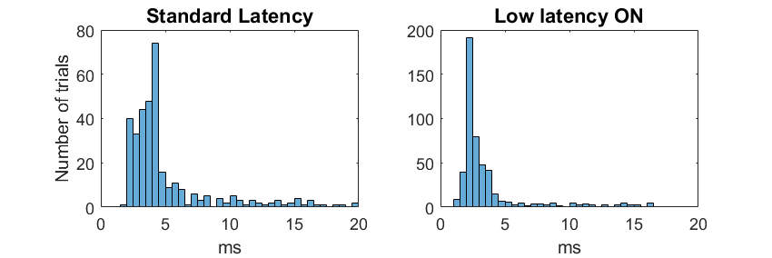

SpikeGLX-CPP-SDK
================

### What

The SDK lets remote Windows and Linux applications communicate with SpikeGLX
versions 20220101 and later:

* Set/get parameters.
* Start/Stop runs.
* Start/stop writing.
* Fetch data in real time.
* Everything you need to integrate SpikeGLX into your workflow.

Explicitly supported in this package:

* C++
* ANSI C
* C# (Windows)
* Python

> *Any other language that binds to C or C++ can be used if you provide
the wrapper calls*.

There's an included closed-loop latency test program; used to obtain these
results on an i7-8850H, 2.6 GHz laptop:

>*Note: Low latency mode is available with SpikeGLX 20230815 and later.*

### Who

The SDK is developed by [Bill Karsh](https://www.janelia.org/people/bill-karsh)
of the [Tim Harris Lab](https://www.janelia.org/lab/harris-lab-apig) at
HHMI/Janelia Research Campus.

### Building in Windows

In Windows you get precompiled components. You don't have to build anything.

I build using Qt 5.12.0 (MinGW 64-bit). Compiled components include
supporting DLLs from that Qt version.

### Building in Linux

You do have to compile for Linux:

You edit/run SpikeGLX-CPP-SDK/Linux/API/make-install.sh to build libSglxApi.so,
and set up the API headers. The Linux version builds with your local g++; there
is no Qt dependence.

### Licensing

Use is subject to Janelia Research Campus Software license terms:
[http://license.janelia.org/license](http://license.janelia.org/license).

_fin_

